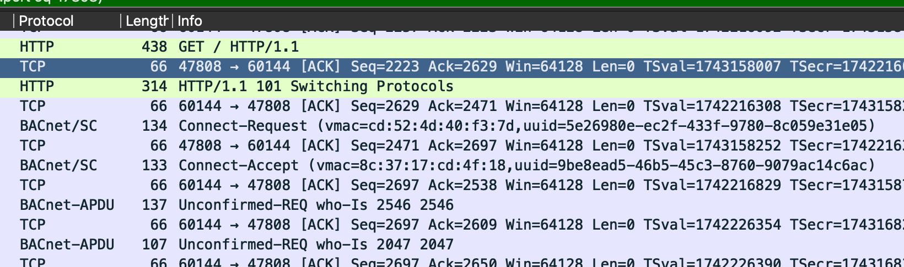
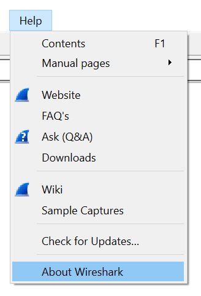
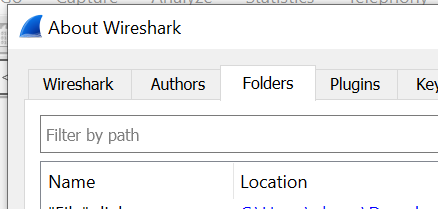
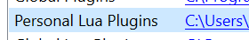
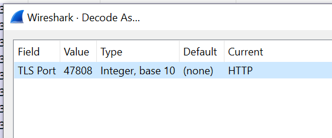
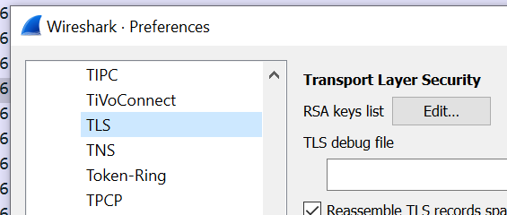
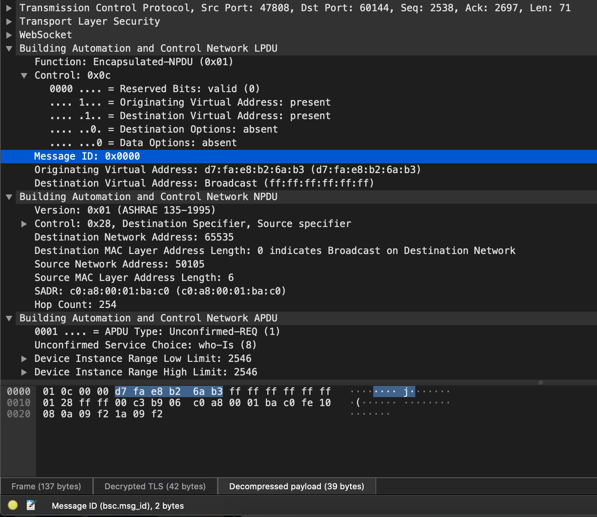
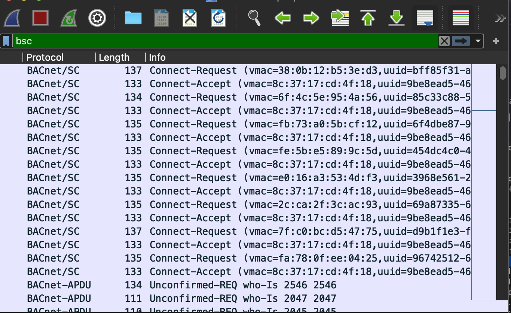

(:trumpet: **Note:** This project has been archived following [the release](https://www.wireshark.org/news/20221004.html) of Wireshark 4.0, which includes native support for Secure Connect. :trumpet:)

# BACnet Secure Connect Dissector for Wireshark

With this plugin, you can view and analyze [BACnet Secure Connect (BACnet/SC)](http://www.bacnet.org/Addenda/Add-135-2016bj.pdf) traffic from within [Wireshark](https://www.wireshark.org/).  This plugin has been tested with node-to-hub communication and node-to-node (direct connect) communication.

## Installation

Ensure that you have a recent (>= 3.0.0) version of Wireshark installed.  Then, add the included [`bsc.lua`](https://github.com/prefork/sc-dissector/archive/v0.1.0.zip) file to your Wireshark [Plugin Directory](https://www.wireshark.org/docs/wsug_html_chunked/ChPluginFolders.html).  That's it.

### How do I find my plugin directory?

1. Open `Help -> About Wireshark` on Windows and Linux or `Wireshark -> About Wireshark` on MacOS.

2. Go to the `Folders` tab.

3. Click on the link in the row labeled `Personal Lua Plugins`.  If the folder doesn't already exist, Wireshark will offer to create it for you.

4. A folder will open. This is where you should put the included `bsc.lua` file.

## Setup

BACnet/SC is different than other BACnet data links because it runs on top of another existing transport layer called WebSockets. WebSockets run on top of HTTP, HTTP runs on top of TLS, and TLS runs on top of TCP (wowsers).

### Asking Wireshark to decode your traffic

_If your traffic is on TCP port 80 or 443, you can skip this part._

1. Open `Analyze -> Decode As` and click the `+` icon to add a new row to the table.
2. If your traffic is TLS encrypted, set `Field` to `TLS Port`. Otherwise, set `Field` to `TCP port`.
3. Set `Value` to the TCP port number you are using, and `Current` to `HTTP`.  If you are using port 47808, it should look like this:

   

### Decrypting your TLS traffic

_If your traffic is in plain text, you can skip this part._

BACnet/SC traffic is encrypted over the wire, which is good because no one else on the network can read it or tamper with it. It's also frustrating if you want to troubleshoot a device.

#### Getting the keys

Fortunately, Wireshark has support for [decrypting TLS traffic](https://wiki.wireshark.org/TLS#TLS_Decryption). Doing this requires having access to one of the nodes' private keys OR having access to to a key log file. Getting access to either of these things is usually application and device specific.

If you're a software developer looking to add support for key log files to your application, here are a few links that might get you started:
 - The original [SSLKEYLOGFILE](https://developer.mozilla.org/en-US/docs/NSS_Key_Log_Format) from NSS
 - An [Agent](https://github.com/jsslkeylog/jsslkeylog/) for Java programs
 - The relevant [function call](https://www.openssl.org/docs/man1.1.1/man3/SSL_CTX_get_keylog_callback.html) for OpenSSL
 - The relevant [property](https://github.com/python/cpython/commit/c7f7069e77c58e83b847c0bfe4d5aadf6add2e68) in recent versions of Python

#### Registering them with Wireshark

1. Open `Edit -> Preferences` on Windows and Linux or `Wireshark -> Preferences` on MacOS.
2. Expand the tree item labeled `Protocols` and click on `TLS`.

   

   1. If you have a private key from a node, register it by clicking `Edit` button and adding it to the `RSA keys list`.
   2. If you have a key log file, click `Browse` to set the `(Pre)-Master-Secret log filename`.
3. Click `OK` to save your changes.

## Usage

Once the plugin is installed and TLS decryption is working, you should be able to explore and analyze BACnet APDUs and NPDUs like normal.

Additionally, you will be able to view fully dissected BACnet/SC headers and payloads.

### Supported message types

This plugin supports dissecting the following BACnet/SC message types:

- BVLC-Result
- Encapsulated-NPDU
- Address-Resolution
- Address-Resolution-ACK
- Advertisement
- Advertisement-Solicitation
- Connect-Request
- Connect-Accept
- Disconnect-Request
- Disconnect-Accept
- Heartbeat-Request
- Heartbeat-ACK

Additionally, limited support is provided for working with Proprietary-Message messages.

### Example filters

With this plugin, you can filter messages based on over forty different fields.  Here are some examples:

| Description                   | Expression |
|-------------------------------|------------|
| All BACnet messages           | `bsc`      |
| Link layer broadcast messages | `bsc.destination_vmac == ff:ff:ff:ff:ff:ff` |
| Connect requests from `96742512-60b0-4e50-bd0e-accaadcf164e` | `bsc.connect_request.uuid == 96742512-60b0-4e50-bd0e-accaadcf164e` |
| Nodes connected to a secondary hub | `bsc.advertisement.conn_status == 2` |
| Proprietary header options from vendor `510` | `bsc.option.vendor_id == 510` |

### Supported fields

#### All messages

| Field                        | Selector                                   | Data Type |
|------------------------------|--------------------------------------------|-----------|
| Function                     | `bsc.function`                             | `uint8`   |
| Control                      | `bsc.control`                              | `uint8`   |
| Reserved Bits                | `bsc.control.reserved`                     | `uint8`   |
| Originating Virtual Address  | `bsc.control.has_orig_vmac`                | `bool`    |
| Destination Virtual Address  | `bsc.control.has_dest_vmac`                | `bool`    |
| Destination Options          | `bsc.control.has_dest_opts`                | `bool`    |
| Data Options                 | `bsc.control.has_data_opts`                | `bool`    |
| Message ID                   | `bsc.message_id`                           | `uint16`  |
| Originating Virtual Address  | `bsc.originating_vmac`                     | `ether`   |
| Destination Virtual Address  | `bsc.destination_vmac`                     | `ether`   |
| Destination Option           | `bsc.destination_option`                   | `none`    |
| Data Option                  | `bsc.data_option`                          | `none`    |
| Header Option Marker         | `bsc.option.marker`                        | `none`    |
| More Options Follow?         | `bsc.option.has_more`                      | `bool`    |
| Must Understand?             | `bsc.option.must_understand`               | `bool`    |
| Header Option Data Present?  | `bsc.option.has_data`                      | `bool`    |
| Option Type                  | `bsc.option.type`                          | `uint8`   |
| Option Length                | `bsc.option.length`                        | `uint16`  |
| Option Data                  | `bsc.option.data`                          | `none`    |
| Vendor ID                    | `bsc.option.vendor_id`                     | `uint16`  |
| Proprietary Type             | `bsc.option.proprietary_type`              | `uint8`   |
| Data                         | `bsc.option.proprietary_data`              | `none`    |
| Payload                      | `bsc.payload`                              | `none`    |

#### BVLC-Result messages

| Field                        | Selector                                   | Data Type |
|------------------------------|--------------------------------------------|-----------|
| Function                     | `bsc.bvlc_result.function`                 | `uint8`   |
| Result                       | `bsc.bvlc_result.code`                     | `uint8`   |
| Error Marker                 | `bsc.bvlc_result.error_marker`             | `uint8`   |
| Error Class                  | `bsc.bvlc_result.error_class`              | `uint16`  |
| Error Code                   | `bsc.bvlc_result.error_code`               | `uint16`  |
| Error Details                | `bsc.bvlc_result.error_details`            | `string`  |

#### Address-Resolution-ACK messages

| Field                        | Selector                                   | Data Type |
|------------------------------|--------------------------------------------|-----------|
| WebSocket URI                | `bsc.address_resolution.uri`               | `string`  |

#### Advertisement messages

| Field                        | Selector                                   | Data Type |
|------------------------------|--------------------------------------------|-----------|
| Hub Connection Status        | `bsc.advertisement.conn_status`            | `uint8`   |
| Accepts Direct Connects      | `bsc.advertisement.accepts_direct_connects`| `uint8`   |
| Maximum BVLC Length          | `bsc.advertisement.maximum_bvlc_len`       | `uint16`  |
| Maximum NPDU Length          | `bsc.advertisement.maximum_npdu_len`       | `uint16`  |

#### Connect-Request messages

| Field                        | Selector                                   | Data Type |
|------------------------------|--------------------------------------------|-----------|
| VMAC Address                 | `bsc.connect_request.vmac`                 | `ether`   |
| Device UUID                  | `bsc.connect_request.uuid`                 | `guid`    |
| Maximum BVLC Length          | `bsc.connect_request.maximum_bvlc_len`     | `uint16`  |
| Maximum NPDU Length          | `bsc.connect_request.maximum_npdu_len`     | `uint16`  |

#### Connect-Accept messages

| Field                        | Selector                                   | Data Type |
|------------------------------|--------------------------------------------|-----------|
| VMAC Address                 | `bsc.connect_accept.vmac`                  | `ether`   |
| Device UUID                  | `bsc.connect_accept.uuid`                  | `guid`    |
| Maximum BVLC Length          | `bsc.connect_accept.maximum_bvlc_len`      | `uint16`  |
| Maximum NPDU Length          | `bsc.connect_accept.maximum_npdu_len`      | `uint16`  |

#### Proprietary Messages

| Field                        | Selector                                   | Data Type |
|------------------------------|--------------------------------------------|-----------|
| Vendor ID                    | `bsc.proprietary_message.vendor_id`        | `uint16`  |
| Function                     | `bsc.proprietary_message.function`         | `uint8`   |
| Proprietary Data             | `bsc.proprietary_message.data`             | `bytes`   |

## Contributing

Pull requests are welcome. For major changes, please open an issue first to discuss what you would like to change.

## FAQ

### Why isn't this built into Wireshark like other parts of BACnet?

Getting BACnet/SC support into Wireshark is my ultimate goal.

Rather than developing a [built-in dissector](https://www.wireshark.org/docs/wsdg_html_chunked/ChSrcContribute.html) right away, I thought it might be nice to build some consensus around what sort of information needs to be surfaced from BACnet/SC messages and what the best way to present it is.

### How is this software licensed?

Like [Wireshark](https://wiki.wireshark.org/Lua#Beware_the_GPL), this software is licensed under the GPL
